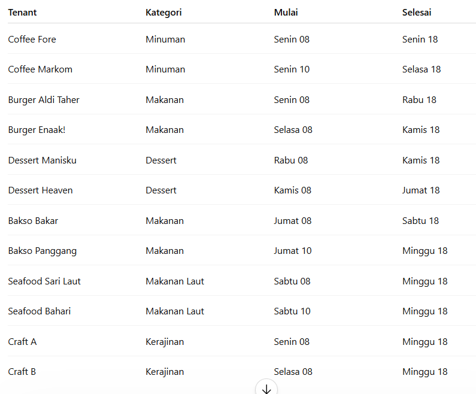

# Greedy-vs-Bactracking
## Judul:
**Sistem Penjadwalan Otomatis Tenant Bazar Restoran Selama Seminggu Menggunakan Algoritma Greedy dan Backtracking**

## Masalah:
Restoran mengadakan bazar UMKM selama satu minggu. Jumlah tenant yang mendaftar melebihi kapasitas stand yang tersedia. Selain itu terdapat konflik penempatan antar tenant berdasarkan kategori produk dan kebutuhan fasilitas.

## Kendala
* Jumlah stand terbatas (5 stand)
* Tenant dengan kategori sama tidak boleh berdampingan.
* Tenant tidak boleh menggunakan stand yang sama pada waktu yang bertabrakan.

### Peran Greedy (Activity Selection)
Algoritma Greedy (Activity Selection) digunakan untuk memilih tenant yang dapat dijadwalkan tanpa benturan waktu dengan tujuan memaksimalkan jumlah tenant yang dapat berpartisipasi.

### Peran Backtracking (Graph Coloring)
Algoritma Backtracking (Graph Coloring) digunakan untuk menentukan alokasi stand bagi tenant terpilih dengan mempertimbangkan konflik kategori produk.

## Dataset / Data Dummy:

_Pada versi prototype ini, data pendaftaran tenant masih menggunakan data dummy yang disimpan di SampleData.java. Pada implementasi nyata, data tersebut dapat berasal dari form pendaftaran atau database_